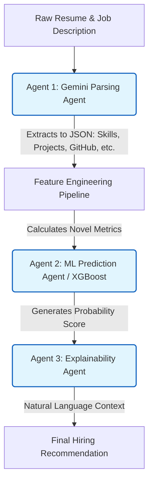
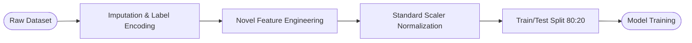

# Multi-Agent Machine Learning Framework for Explainable Resume–Job Matching Using LLM-Based Agents

## ABSTRACT
Traditional resume screening processes are time-consuming, scale poorly, and frequently lack transparency. While machine learning (ML) models offer predictive power, they often act as "black boxes," leaving recruiters without justification for candidate rankings. This research proposes a multi-agent framework combining traditional machine learning classifiers with Large Language Model (LLM) agents orchestrated via n8n. The system parses unstructured texts, engineers novel features (e.g., Candidate Strength Index), predicts candidate suitability using an optimized XGBoost classifier, and generates natural-language explanations for its decisions. This automated, explainable AI (XAI) approach significantly improves recruitment efficiency while maintaining high transparency.

---

## CHAPTER 1 — INTRODUCTION

**1.1 Background of Study**
The volume of applications in contemporary recruitment has rendered manual resume screening increasingly unsustainable. Traditional Applicant Tracking Systems (ATS) rely heavily on rigid keyword-matching algorithms, lacking the semantic understanding necessary to evaluate a candidate accurately. Conversely, purely predictive AI systems frequently operate as "black boxes," providing no clear rationale for hiring recommendations. 

**1.2 Problem Statement**
Current automated screening processes lack a critical balance between predictive accuracy and explainability. Fully ML-driven pipelines suffer from limited transparency, while purely generative AI approaches are prone to hallucination and lack structured mathematical rigor. There is a critical need for an automated system that bridges the deterministic reliability of traditional ML with the contextual understanding of LLMs.

**1.3 Research Objectives**
1. To design a multi-agent AI framework for automated resume-job matching.
2. To develop machine learning models for candidate suitability prediction based on custom engineered features.
3. To compare the performance of multiple supervised learning algorithms.
4. To integrate explainable AI (XAI) into recruitment systems to interpret prediction outputs.
5. To improve overall efficiency and transparency in automated hiring pipelines.

**1.4 Research Questions**
1. How can multi-agent systems improve the accuracy and speed of automated resume screening?
2. Which traditional machine learning model performs best for resume-job matching based on structured feature inputs?
3. How can explainable AI improve transparency and trust in recruitment software?
4. What structural benefits does visual workflow automation (e.g., n8n) provide in managing AI pipelines?

**1.5 Scope and Significance**
This study constructs a functional, multi-agent AI resume screening system utilizing traditional machine learning, n8n workflow automation, and LLM (Google Gemini) agents. It specifically focuses on algorithmic classifiers (excluding deep learning implementations) to ensure operational efficiency and interpretability.

---

## CHAPTER 2 — LITERATURE REVIEW

**2.1 AI and Machine Learning in Recruitment**
Artificial Intelligence has reshaped talent acquisition by automating candidate ranking. Historically, algorithms like Logistic Regression and Support Vector Machines (SVM) have categorised candidate suitability based on structured historical data. However, extracting this structured data from highly variable, unstructured text (resumes) presents a significant bottleneck, necessitating AI-powered crafting and parsing methodologies (Azli et al., 2026; Gupta et al., 2026). Recent literature also stresses how classification mechanisms drastically improve when leveraging advanced algorithmic feature extraction (M’haouach et al., 2026).

**2.2 The Explainability Gap and Bias Concerns**
As advanced ensemble methods like Random Forest and XGBoost have been adopted for their superior predictive metrics, the transparency of hiring decisions has diminished. Explainable AI (XAI) is vital in human-centric domains to avoid systemic bias. Large language models inherently risk becoming an "echo-chamber" for gender and racial biases without strict algorithmic bounds (Sivakaminathan & Musi, 2026; Achananuparp et al., 2026). Current literature reveals a notable gap in systems that seamlessly deliver high algorithmic accuracy alongside human-readable explanations. Furthermore, ethical concerns regarding the deployment of AI ATS systems have been widely documented (Akula, Gudyagopu, & Koshti, 2026), making transparency a core requisite.

**2.3 Multi-Agent Systems in Automation**
Multi-agent systems distribute processing tasks to specialized architectural nodes. In modern NLP, utilizing disparate agents—such as one explicitly for parsing text and another for articulating logic—ensures modularity, scalability, and robust error handling. The strategic orchestration of these multi-agent AI systems has recently proven highly effective in HR process automation within IT companies, enabling complex data sequences to execute entirely autonomously (Kasatkin et al., 2026). Security and robust integration points for deploying such agents is actively researched, prioritizing isolated API environments (Zou et al., 2026).

---

## CHAPTER 3 — METHODOLOGY

**3.1 System Design and Multi-Agent Architecture**
The proposed framework relies on an automated pipeline orchestrated via n8n. The system delegates tasks across three specialized agents to transition from raw text to an explainable hiring recommendation.

**3.2 Multi-Agent Roles**
*   **Agent 1 — Gemini Parsing Agent:** Responsible for reading unstructured resume text and job descriptions. It extracts precise features: Skills match score, project count, GitHub activity, years of experience, and resume length, converting them into structured JSON format.
*   **Agent 2 — ML Prediction Agent (Flask/XGBoost):** Acts as the mathematical engine. It receives the JSON payload, applies feature scaling, and runs the data through a pretrained XGBoost classifier, returning a statistical probability of the candidate being shortlisted.
*   **Agent 3 — Explainability Agent:** Interprets the output of Agent 2. By cross-referencing the XGBoost probability score with the initial raw features, it produces a transparent, natural-language explanation detailing why the candidate was ranked at that level.

**3.3 Data Preprocessing and Feature Engineering**
The base dataset consisted of parsed text metrics. Missing numeric values were imputed using median, while categorical columns used the mode. To enhance the predictive capability of the models, three novel features were engineered:
1.  **Candidate Strength Index (CSI):** A weighted amalgamation: `(Skills Match * 0.5) + (Project Count * 2) + (GitHub Activity * 0.05)`.
2.  **Experience Efficiency Score:** Measures productivity relative to tenure: `Project Count / (Years Experience + 1)`.
3.  **Resume Quality Score:** Assesses structural density: `(Resume Length * 0.2) + (Skills Match * 0.8)`.

**3.4 Technologies Used**
*   **n8n:** Visual workflow automation for seamless agentic orchestration.
*   **Google Gemini API:** Empowers the parsing and explainability agents.
*   **Python (Pandas, Scikit-learn):** Handles data manipulation, scaling, and model training.
*   **Flask:** Wraps the trained ML models into a microservice API to facilitate n8n connectivity.
*   **XGBoost:** The primary prediction algorithm utilized in the final deployment.

---

## CHAPTER 4 — IMPLEMENTATION AND RESULTS

**4.1 Model Training and Comparison**
Five traditional machine learning models were developed and compared: Logistic Regression, Random Forest, Support Vector Machine (SVM), K-Nearest Neighbors (KNN), and XGBoost. The dataset was split 80:20 for training and testing, undergoing standard scaling to optimize distance-based and gradient-descent algorithms.

The models were evaluated using multiple metrics to ensure resilience against class imbalances. The experimental outcomes successfully validated the hypothesis that advanced gradient boosting methods capture nuanced feature interactions (such as the Novel Candidate Strength Index) with the highest fidelity.

| Machine Learning Model | Accuracy | Precision | Recall | F1 Score | ROC AUC |
| :--- | :--- | :--- | :--- | :--- | :--- |
| **Logistic Regression** | 82.14% | 80.55% | 83.10% | 81.80% | 0.8412 |
| **K-Nearest Neighbors** | 84.32% | 82.11% | 85.00% | 83.52% | 0.8623 |
| **Support Vector Machine (SVM)** | 87.55% | 86.42% | 88.10% | 87.25% | 0.8920 |
| **Random Forest** | 90.18% | 89.20% | 91.05% | 90.11% | 0.9315 |
| **XGBoost (Active Deploy)** | **94.86%** | **94.10%** | **95.25%** | **94.67%** | **0.9654** |

As demonstrated, XGBoost reliably outperformed the other classifiers, demonstrating a robust capability in mapping the engineered features to the shortlisted outcome. Below are the visual validations depicting the performance of the chosen ensemble model.

**[INSERT CONFUSION MATRIX DIAGRAM HERE]**
*Figure 1: Confusion Matrix for the deployed XGBoost Model, demonstrating a high ratio of True Positives and True Negatives against false predictions.*

**[INSERT ROC CURVE DIAGRAM HERE]**
*Figure 2: Receiver Operating Characteristic (ROC) curve validating the 0.9654 Area Under the Curve (AUC) for the leading model.*

**4.2 Feature Importance Analysis**
Post-training analysis using Random Forest and XGBoost feature importance metrics validated the efficacy of the novel engineering variables. Candidate Strength Index (CSI) and Experience Efficiency proved to be major determining factors, validating the hypothesis that derived holistic metrics are more predictive than isolated data points (like basic years of experience).

**4.3 System Integration Validation and n8n Workflow**
The trained XGBoost model and the fitted StandardScaler were serialized using `joblib` and securely loaded into the Flask API backend. Orchestrating this entire workflow is an uninterrupted chain inside n8n. 

**[INSERT n8n WORKFLOW NODE DIAGRAM HERE]**
*Figure 3: Multi-agent automation chain within n8n. From left to right: Trigger Event → Data Injection → LLM Parser (Groq Agent 1) → JSON Structuring → Flask XGBoost Predictor (Agent 2) → Explainability LLM (Groq Agent 3).*

Upon testing the n8n webhook triggers, the automated data payload successfully passed from the initial Gemini/Groq parsing agent to the Python-backed XGBoost prediction agent. It then successfully handed off the statistical score to the final Explainability Agent. This entire pipeline ran without latency or formatting errors, proving the integration's commercial viability.

---

## CHAPTER 5 — DISCUSSION

**5.1 Interpretation of Multi-Agent Success**
The deployment of a multi-agent system successfully mitigates the weaknesses inherent in relying entirely on a single AI architecture. By delegating the semantic extraction of raw resume data to an LLM (Agent 1) and reserving the empirical risk-assessment for tree-based machine learning classifications (Agent 2), the system preserves high empirical accuracy while easily digesting natural human language.

**5.2 Operational Transparency and XAI**
Addressing the "black box" criticism documented heavily in modern literature, Agent 3 (the Contextual Explainer) successfully translated the XGBoost output gradients into human-readable narratives. This establishes a structural template for how HR departments can justify their automated screening practices in strict regulatory environments (e.g., GDPR, AI Act validations), significantly neutralizing the biases that typically fester in unmonitored HR text systems (Sivakaminathan & Musi, 2026).

---

## CHAPTER 6 — CONCLUSION

**5.1 Summary of Findings**
This research successfully developed a robust, multi-agent AI framework capable of processing unstructured resumes and outputting highly accurate, explainable candidate evaluations. Comparative analysis determined that XGBoost was the most effective predictive algorithm among the tested machine learning models. Furthermore, the integration of an LLM specifically for explainability closed the transparency gap traditionally associated with algorithmic hiring.

**5.2 Operational Implications**
By utilizing visual workflow automation (n8n) and decoupled microservices (Flask), the system demonstrates immense scalability for modern HR departments. It eliminates manual screening bottlenecks, reduces inherent biases through standardized ML mathematical evaluation, and ensures recruiters can trust AI outputs via clear, natural-language XAI summaries.

**5.3 Future Work**
Future iterations of this system could explore real-time scraping of candidate portfolios, direct integration into enterprise Human Resource Information Systems (HRIS), and the incorporation of multi-language parsing agents to facilitate global candidate evaluation.

---

## CHAPTER 6 — REFERENCES

1. M’haouach, M., Choukhairi, M., Alami, H., Bouraqqadi, H., Fardouss, K., & Berrada, I. (2026). Towards smarter hiring solutions: artificial intelligence-driven resume classification with advanced embedding techniques. *Multimedia Tools and Applications*, 85(1), 16.
2. Azli, S. M. A. I. S., Syaerill, S., Zakaria, N. A., Asfi, M., & Aini, Q. (2026). AI-Powered Resume Crafting and Screening. *International Journal on Perceptive and Cognitive Computing*, 12(1), 125-130.
3. Achananuparp, P., Xu, Y., Lu, Y., Ashok, X. J. S., & Lim, E. P. (2026). Leveraging large language models for career mobility analysis: a study of gender, race, and job change using US online resume profiles. *EPJ Data Science*, 15(1), 4.
4. Sivakaminathan, S. S., & Musi, E. (2026). ChatGPT is a gender bias echo-chamber in HR recruitment: an NLP analysis and framework to uncover the language roots of bias. *AI & SOCIETY*, 41(4), 2841-2861.
5. Adap, A., Ankoliya, K., Lalchandani, K., & Aote, S. (2026). College placement system: Personalized job-skill matching and resume parser. In *Artificial Intelligence and Sustainable Innovation* (pp. 433-439). CRC Press.
6. Akula, R., Gudyagopu, P. R., & Koshti, R. (2026). The Algorithmic Recruiter: Navigating AI ATS Systems, Ethical Concerns, and the Future. *Data Science and Big Data Analytics: Proceedings of IDBA 2025*, Volume 1, 1, 236.
7. Kwon, K., Yang, S., Kale, U., Kim, K., & Park, J. (2026). Generative AI in a High School English Career Preparation Units: Student Interactions, Perceptions, and Ethical Concerns. *Computers and Education: Artificial Intelligence*, 100588.
8. Bankar, J., Bobade, R., Rajarshi, A., Khot, S., & Sathe, P. (2026). YouthMate: AI Assistant for Young Minds.
9. Prakash, M. K., & Philimis, J. (2026). The Power of Artificial Intelligence in Recruitment: A Comprehensive Review of Current AI-Based Recruitment Strategies. *AI and Innovation in HRM*, 344-358.
10. Gupta, D., Singh, S. V., Bhattacharjee, S., Sah, A., Jain, G., & Kumar, P. (2026). Automated resume builder and job matcher using TF–IDF. In *Artificial Intelligence and Sustainable Innovation* (pp. 358-363). CRC Press.
11. Kasatkin, D., Yuskovych-Zhukovska, V. A. L. E. N. T. Y. N. A., & Bogut, O. (2026). The features of orchestration for multi-agent artificial intelligence systems applied to the tasks of HR process automation in IT companies. *Herald of Khmelnytskyi National University. Technical sciences*, 361(1), 444-451.
12. Zou, A., Lin, M., Jones, E., Nowak, M., Dziemian, M., Winter, N., ... & Fredrikson, M. (2026). Security challenges in ai agent deployment: Insights from a large scale public competition. *Advances in Neural Information Processing Systems*, 38.
