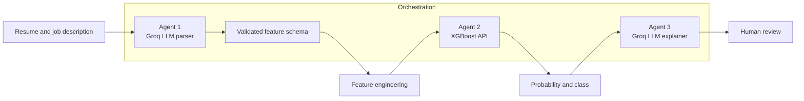

<div align="center">

# Explainable Multi-Agent Resume-Job Matching

**A research prototype combining LLM-based extraction, supervised learning, and human-readable decision support.**

[](https://www.mmupress.com/sitwe2026/)
[](https://www.python.org/)
[](https://github.com/BakaryGibba/Multi-Agent-Resume-Analysis-Research/actions/workflows/tests.yml)
[](docs/RESPONSIBLE_USE.md)

[Paper status](#publication-status) | [Architecture](#system-at-a-glance) | [Results](#experimental-evidence) | [Reproduce](docs/REPRODUCIBILITY.md) | [Responsible use](docs/RESPONSIBLE_USE.md)

</div>

> [!IMPORTANT]
> This repository is a research prototype, not an autonomous hiring system. Its outputs must not be used to make employment decisions or rank real candidates without independent validation, fairness assessment, legal review, and meaningful human oversight.

## Publication Status

**Accepted for presentation** at the [3rd International Symposium on Information Technology and Web Engineering (SITWE 2026)](https://www.mmupress.com/sitwe2026/), held virtually on 29-30 September 2026.

Acceptance for presentation does not imply final journal publication. The manuscript remains subject to the venue's camera-ready and editorial process.

## Research Question

Can a modular pipeline combine the structure of supervised learning with the language capabilities of LLM agents to make resume-job matching outputs easier to inspect?

The prototype separates extraction, prediction, and explanation so each stage can be evaluated independently. This is an architectural study of decision support, not evidence that AI can replace professional recruitment judgment.

## System At A Glance



| Layer | Responsibility | Technology |
| --- | --- | --- |
| Orchestration | Routes data and isolates agent responsibilities | n8n |
| Semantic extraction | Converts text into a constrained feature schema | Groq API, Llama 3.1 |
| Prediction | Produces an experimental shortlist probability | Flask, XGBoost |
| Explanation | Summarizes model inputs and output for review | Groq API, Llama 3.1 |
| Experimentation | Trains and compares five classifiers | pandas, scikit-learn, XGBoost |

## Experimental Evidence

The committed notebook records one stratified 80/20 train-test split (`random_state=42`) over 30,000 tabular records. XGBoost ranked highest by ROC-AUC.

| Model | Accuracy | F1 | ROC-AUC |
| --- | ---: | ---: | ---: |
| Logistic Regression | 90.38% | 0.9315 | 0.9618 |
| Random Forest | 90.32% | 0.9312 | 0.9634 |
| Support Vector Machine | 90.58% | 0.9332 | 0.9486 |
| K-Nearest Neighbors | 89.65% | 0.9263 | 0.9363 |
| **XGBoost** | **90.63%** | **0.9333** | **0.9659** |

> [!NOTE]
> These are held-out results from a single dataset split, not external validation. They do not establish fairness, causal validity, or real-world hiring performance. See the [model card](docs/MODEL_CARD.md).

## Research Contributions

- A three-stage architecture that keeps LLM extraction and explanation separate from statistical prediction.
- Three composite experimental features: Candidate Strength Index, Experience Efficiency, and Resume Quality Score.
- A comparative benchmark across five classical supervised-learning models.
- An importable n8n workflow and local Flask inference boundary.
- Explicit documentation of intended use, data provenance, model limits, and reproducibility.

## Repository Map

| Resource | Purpose |
| --- | --- |
| [`ai-resume-merging.ipynb`](ai-resume-merging.ipynb) | Data preparation, model comparison, evaluation, and artifact export |
| [`app.py`](app.py) | Validated local inference API used by the workflow |
| [`Multi-Agent AI Resume Screening System (Groq).json`](Multi-Agent%20AI%20Resume%20Screening%20System%20%28Groq%29.json) | Sanitized n8n workflow export |
| [`Research_Report.md`](Research_Report.md) | Long-form research narrative and references |
| [`docs/REPRODUCIBILITY.md`](docs/REPRODUCIBILITY.md) | Reproduction path and environment guidance |
| [`docs/DATA_CARD.md`](docs/DATA_CARD.md) | Dataset provenance, scope, and constraints |
| [`docs/MODEL_CARD.md`](docs/MODEL_CARD.md) | Model behavior, metrics, and limitations |
| [`docs/RESPONSIBLE_USE.md`](docs/RESPONSIBLE_USE.md) | Safety boundaries and deployment requirements |

## Quick Start

```bash
python -m venv .venv
# Windows: .venv\Scripts\activate
# macOS/Linux: source .venv/bin/activate
pip install -r requirements.txt
pytest -q
python app.py
```

The API listens on `http://127.0.0.1:5000`. Import the n8n workflow separately and provide `GROQ_API_KEY` through n8n's secret/environment configuration. No credential is included in this repository. Full steps are in [Reproducibility](docs/REPRODUCIBILITY.md).

<details>
<summary>Example API request</summary>

```json
{
  "skills_match_score": 85,
  "project_count": 4,
  "github_activity": 70,
  "years_experience": 3,
  "resume_length": 350,
  "education_level": "Masters"
}
```

</details>

## Authors And Roles

**Bakary Gibba** - system design, implementation, experimentation, workflow integration, analysis, and manuscript drafting.

**Sami Salama Hussen Hajjaj** - research supervision, methodological review, and manuscript review.

For academic citation, use [`CITATION.cff`](CITATION.cff) or the citation example in the [reproducibility guide](docs/REPRODUCIBILITY.md#citation).

## Research Documentation

[Data Card](docs/DATA_CARD.md) | [Model Card](docs/MODEL_CARD.md) | [Responsible Use](docs/RESPONSIBLE_USE.md) | [Reproducibility](docs/REPRODUCIBILITY.md) | [Research Report](Research_Report.md)

---

<div align="center">
Research code by <a href="https://github.com/BakaryGibba">Bakary Gibba</a> | Accepted for presentation at SITWE 2026
</div>
